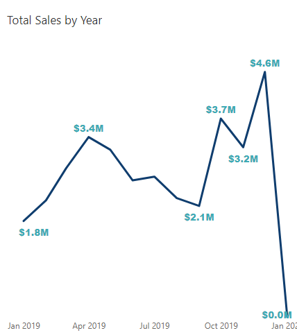

# Sales Data Analysis

## Introduction
This is the first project under the Meriskill internship.
It involves data from a store that sells various products.  
## Technologies Used
- Microsoft Excel
- PowerQuery
- PowerBi
## Problem statement
1. Find out the business trend over time
2. What are the best selling products?
3. Calculate revenue metrics
4. How are sales in various regions?

### Data Preprocessing
The dataset had 18950 rows. No null figures were present in the data.
The data had 10 columns:
- Order ID
- Product
- Quantity Ordered
- Prich for each
- Order date
- Purchase Address
- Month
- Sales
- City
- Hour
  The Purchase address column was dropped since there was a city column alresdy.
  - Sale and price for ach were changed to currency format
  - Using Dax, added a column Months which had the short month name.
  - The hour column was divided into 4 categories:
      - Morning <11
      - Afternoon <16
      - Evening <20
      - Night
## EDA
The store had a total sales of $ 34.49 Million.
A total of 209K products had been ordered across the 9 Cities
###  Find out the business trend over time

December is noted to have the highest sales at $4.6 Million while January had the least at $1.8M. Flactuations were noted mid year too.
![](quarter_
Its difficult to quantify January 2020 sales as it only had date 1.

  
    
