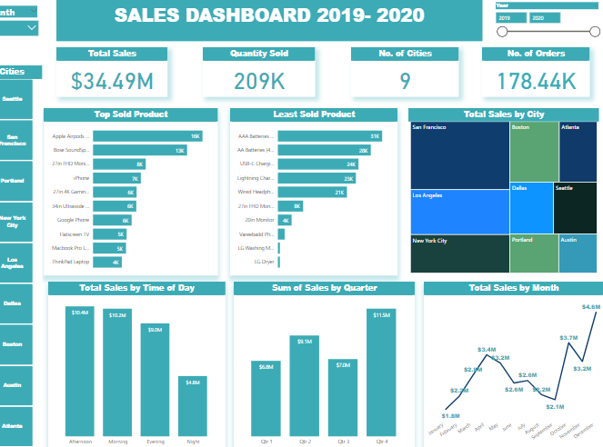
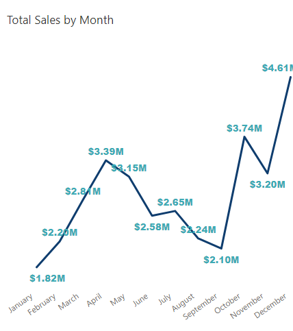
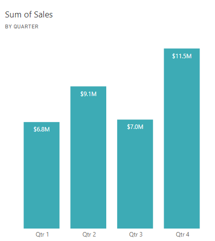
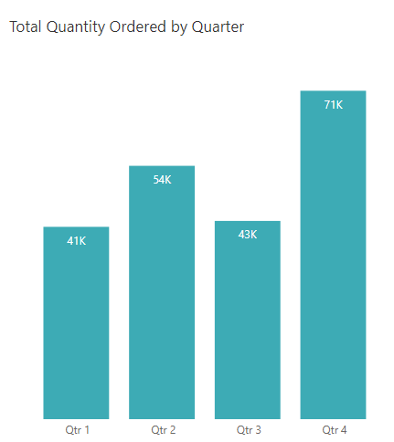
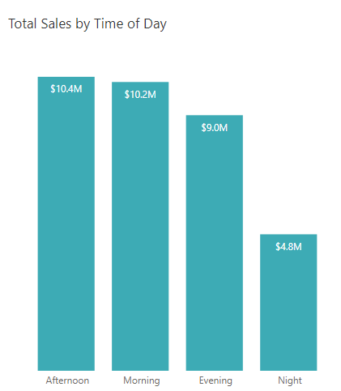
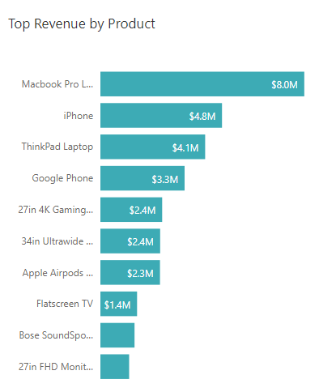
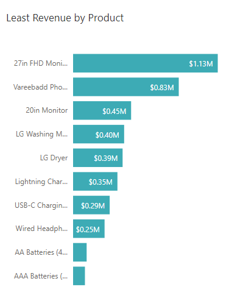
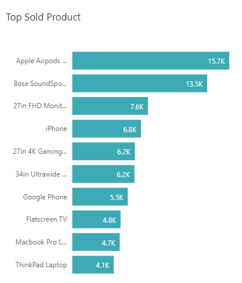
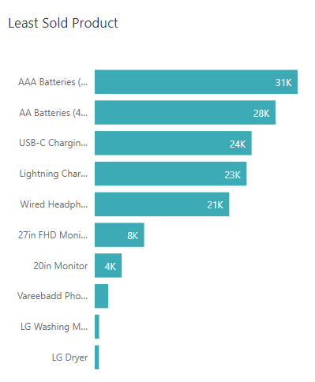
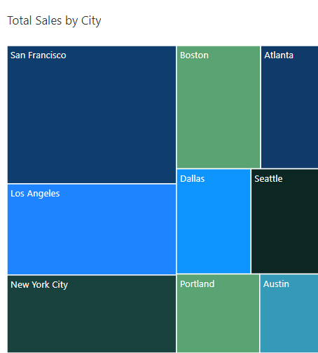

# Sales Data Analysis

## Introduction

This is the first project under the Meriskill internship.
It involves data from a store that sells various products.  
## Technologies Used
- Microsoft Excel
- PowerQuery
- PowerBi
## Problem statement
1. Find out the business trend over time
2. What are the best selling products?
3. Calculate revenue metrics
4. How are sales in various regions?

### Data Preprocessing
The dataset had 18950 rows. No null figures were present in the data.
The data had 10 columns:
- Order ID
- Product
- Quantity Ordered
- Prich for each
- Order date
- Purchase Address
- Month
- Sales
- City
- Hour
  The Purchase address column was dropped since there was a city column alresdy.
  - Sale and price for ach were changed to currency format
  - Using Dax, added a column Months which had the short month name.
  - The hour column was divided into 4 categories:
      - Morning <11
      - Afternoon <16
      - Evening <20
      - Night
## EDA

The store had a total sales of $ 34.49 Million.
A total of 209K products had been ordered across the 9 Cities
###  Find out the business trend over time

December is noted to have the highest sales at $4.6 Million while January had the least at $1.8M. Flactuations were noted mid year too.
Data from January 2020 had only one day hence it'd be difficulty to compare the years.

The fourth quarter of the month had the highest amounts sold and aalso revenue generated.

Sales didn't show a huge difference per time of the day but most sales were made in the afternoon and morning hours with night time  being the least.

### What are the best selling products?

Macbook Pro had the highest revenue at ($8.0M), followed by iPhone($4.8M)  and third being Thinkpad Laptop($4.1M).
The least revenue was accounted for by AAA and AA batteries

We tried to find out why the named products had the least revenue
It was suprising to find that despite the AAA batteries being least in revenue generation, they had a very high order rate. The low revenue could be attributed to their low unit price.

  

### How are sales in various regions?

San Franciso recorded the highest sales(8.3M), followed by Los Angeles ($5.5M).  The least revenue was Austin at $1.8M

## Reccommendation and Conclusion

- Austin and the low income cities would require more marketing strategies. It'd also be prudent to find out feedback from the clients in these States as to what the store might need to improve on.

- The first quarter when the sales are low, more marketing incentives can be employeed for example promotions and discuounts
- For the months when the company is at peak, feedback can be gotten also from employees and customers with regards to satisfaction. The company can also increase the nmber of employees during these times.
- Regular reviews should be done based on the current scores as the baseline, so that improvement can also be detected.

## Acknowledgements
Meriskills definitely for this chance.
I believe this is just a beginning for growth.
