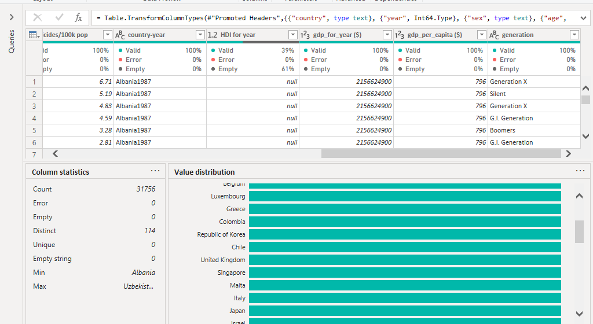
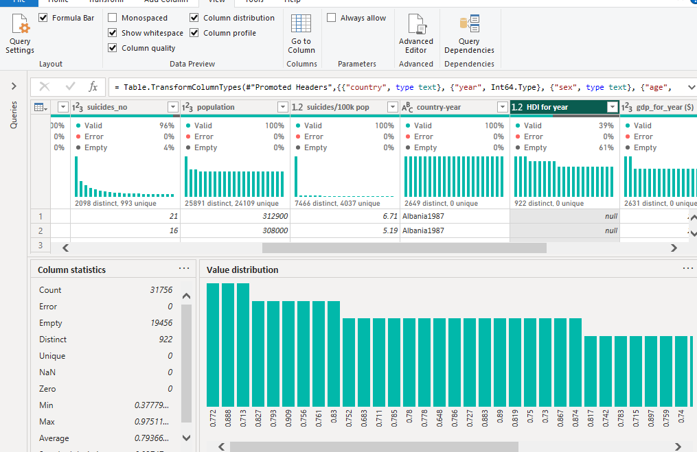
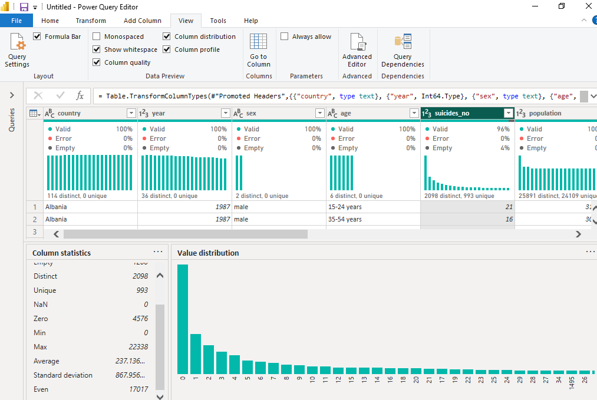

# Global Suicide Rates (1950 - 2021)
> "Creating Hope Through Action" Theme 2020 - 2023
## Introduction

Suicide is the act or an instance of taking one's own life voluntarily and intentionally (Meriam-Webster Dictionary).

According to WHO, More than 700 000 persons die by suicide every year globally. Suicide is the fourth leading cause of death among 15-29 year olds.
This is a power Bi project on suicide global rates. The aim of the project is to analyse and derive insights with regards to suicide and see how we can help resolve the menace.
** NB **: _The data is derived from the Kaggle dataset _
## Data Definition
Our dataset downloaded from kaggle contained :
- country
- year
- sex
- age
- suicides_no
- population
- suicides/100k pop
- country-year
- HDI for year
- gdp_for_year
- gdp_per_capita
- generation
## Problem statement
1. Is there any variation of suicide by gender? How has this evolved over time?
2. Which age group is more vulnerable to suicide?

3. How do different regions and countries vary in terms of suicide rate?
4. Which countries have consistently had high suicide rates?

5. Over the years has there been a rise or decrease of suicide cases? Have there been noticable changes or spikes during certain years?
6. Are there countries which have successfully reduced their suicide rates over time?

7. What's the average suicide rate globally?
8. Is it possible to predict future rates?
## Technologies used
Data was cleaned in Excel and uploaded to PowerBi.
Some of the skills used include: 
- DAX,
 - quick measures, 
 - Filters

## Data transformation
Data was loaded into the powerquery editor and an overview of the columns was checked.
There were 31756 rows and 12 columns. Some of the columns contained null values.
The data types were changed accordingly.

The country column had no null values and no errors the data type is text.

the hdi column had 19456 empty rows and as this would greatly influence our results the column will be dropped.

The column hadd 1200 empty rows. The empty rows were removed.
Since we had the country and year column the country-year column was dropped
A new column for region was added to divide the countries to continents
## Data Analysis and Visualization
